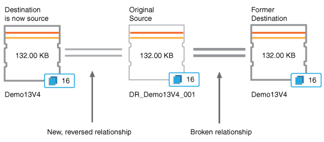

= 保護関係のフェイルオーバーとフェイルバックの実行
:allow-uri-read: 
:icons: font
:imagesdir: ../media/

[role="lead"]
ハードウェア障害や災害によって保護関係のソースボリュームが無効になった場合は、Unified Managerの保護関係機能を使用して保護関係のデスティネーションを読み取り/書き込み可能にし、そのボリュームにフェイルオーバーしてソースがオンラインに戻るまでそのボリュームにフェイルオーバーできます。その後、ソースがデータを提供できるようになったら、元のソースにフェイルバックできます。

* 必要なもの *

* アプリケーション管理者またはストレージ管理者のロールが必要です。
* この処理を実行するには、OnCommand Workflow Automationのセットアップが完了している必要があります。

.手順
. link:task_break_snapmirror_relationship_from_health_volume_details.html["SnapMirror関係を解除する"]です。
+
デスティネーションをデータ保護ボリュームから読み取り/書き込みボリュームに変換する前、および関係を反転する前に、関係を解除する必要があります。

. link:task_reverse_protection_relationships_from_health_volume_details.html["保護関係を反転する"]です。
+
元のソースボリュームが再び使用可能になったら、ソースボリュームをリストアして元の保護関係を再確立することもできます。ソースをリストアする前に、以前のデスティネーションに書き込まれたデータとソースを同期させる必要があります。逆再同期処理を使用して新しい保護関係を作成するには、元の関係のロールを反転し、ソースボリュームを以前のデスティネーションと同期します。新しい関係に対して新しいベースラインSnapshotコピーが作成されます。

+
反転関係は、カスケード関係に似ています。

+

. link:task_break_snapmirror_relationship_from_health_volume_details.html["反転する SnapMirror 関係を解除する"]です。
+
元のソースボリュームが再同期されてデータを提供できるようになったら、解除処理を使用して反転した関係を解除します。

. link:task_remove_protection_relationship_voldtls.html["関係を削除します"]です。
+
反転した関係が不要になった場合は、元の関係を再確立する前にその関係を削除する必要があります。

. link:task_resynchronize_protection_relationships_voldtls.html["関係を再同期します"]です。
+
再同期処理を使用して、ソースからデスティネーションにデータを同期し、元の関係を再確立します。

