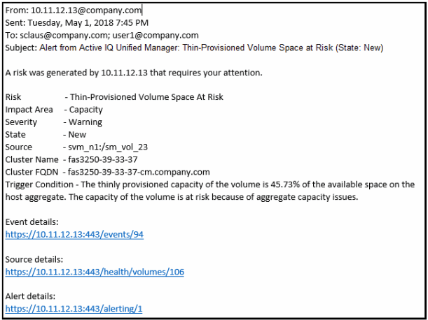

= アラートEメールに含まれる情報
:allow-uri-read: 
:icons: font
:imagesdir: ../media/

[role="lead"]
Unified ManagerのアラートEメールには、イベントのタイプ、イベントの重大度、イベントの原因となった違反したポリシーまたはしきい値の名前、およびイベントの説明が記載されています。また、各イベントのハイパーリンクもEメールメッセージに記載されており、UIでイベントの詳細ページを確認できます。

アラートEメールは、アラートを受信するようにサブスクライブしているすべてのユーザに送信されます。

パフォーマンスカウンタまたは容量の値が収集期間中に大きく変わった場合、同じしきい値ポリシーに対して重大イベントと警告イベントの両方が同時にトリガーされる可能性があります。この場合、警告イベント用と重大イベント用のEメールが1通ずつ送信されることがあります。これは、Unified Managerでは、警告と重大のしきい値違反に対するアラートを受け取るように個別に登録できるためです。

アラートEメールの例を次に示します。

