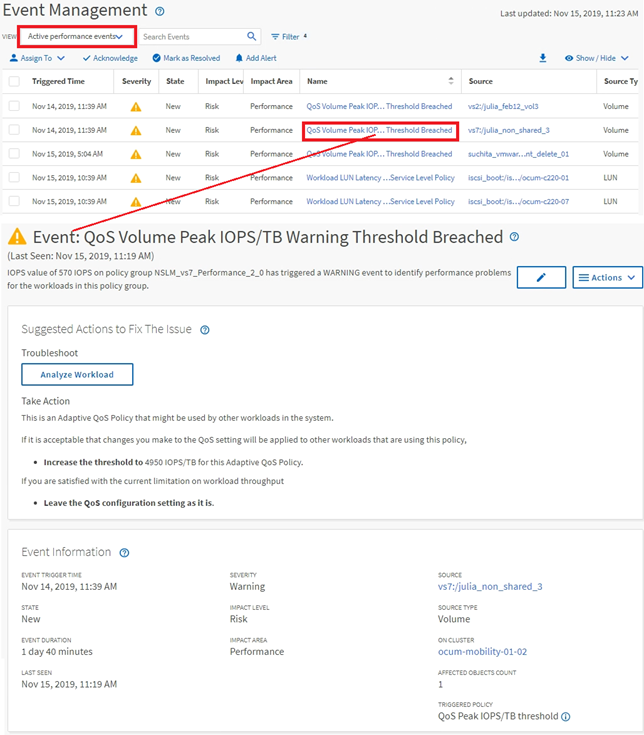

= イベント調査時の画面操作
:allow-uri-read: 
:icons: font
:imagesdir: ../media/

[role="lead"]
Unified Managerのイベント詳細ページには、パフォーマンスイベントの詳細が表示されます。これは、パフォーマンスイベントの調査、トラブルシューティング、およびシステムパフォーマンスの微調整を行う場合に役立ちます。

パフォーマンスイベントのタイプに応じて、次の2種類のイベント詳細ページのいずれかが表示されます。

* ユーザ定義およびシステム定義のしきい値ポリシーのイベントの[イベントの詳細]ページ
* 動的なしきい値ポリシーのイベントの[イベントの詳細]ページ

これは、イベント調査時の操作例の1つです。

. 左側のナビゲーションペインで、 * イベント管理 * をクリックします。
. [ 表示 ] メニューの [ アクティブなパフォーマンスイベント * ] をクリックします。
. 調査するイベントの名前をクリックすると、[イベントの詳細]ページが表示されます。
. イベントの[説明]と[推奨される操作]（該当する場合）を確認して、問題の解決に役立つイベントに関する詳細を確認します。分析ワークロード * ボタンをクリックすると、問題の詳細な分析に役立つ詳細なパフォーマンスチャートを表示できます。

