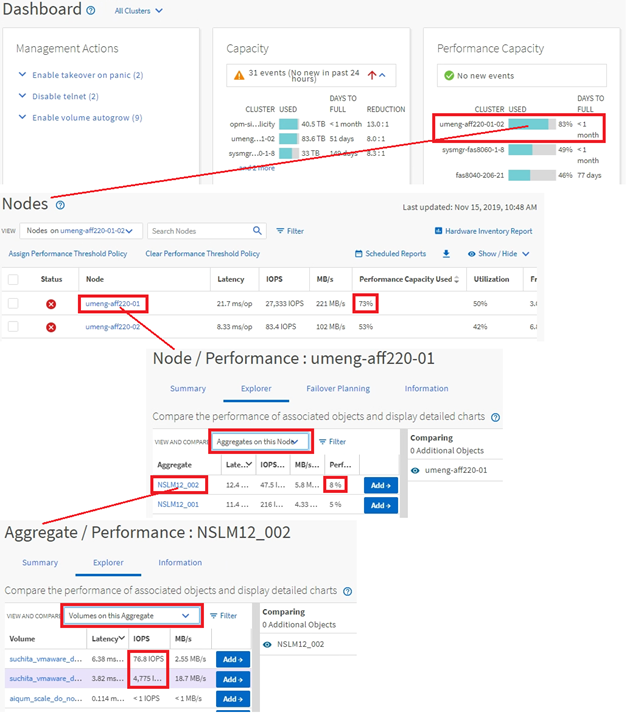

= クラスタオブジェクト監視時の操作
:allow-uri-read: 
:icons: font
:imagesdir: ../media/

[role="lead"]
Unified Managerで管理しているクラスタ内のすべてのオブジェクトのパフォーマンスを監視できます。ストレージオブジェクトの監視では、クラスタとオブジェクトのパフォーマンスの概要を確認し、パフォーマンスイベントを監視できます。パフォーマンスとイベントの概要を表示したり、オブジェクトのパフォーマンスとパフォーマンスイベントの詳細をさらに詳しく調査したりできます。

次に、クラスタオブジェクトを使用したさまざまな操作の例を示します。

. [Dashboard]ページで、[Performance Capacity]パネルの詳細を確認してパフォーマンス容量を使用しているクラスタを特定し、棒グラフをクリックしてそのクラスタのノードのリストに移動します。
. 使用済みパフォーマンス容量の値が最も高いノードを特定し、そのノードをクリックします。
. ノード / パフォーマンスエクスプローラページで、表示と比較メニューからこのノード上のアグリゲートをクリックします。
. 使用済みパフォーマンス容量が最も多いアグリゲートを特定し、そのアグリゲートをクリックします。
. アグリゲート / パフォーマンスエクスプローラページで、表示と比較メニューから、このアグリゲート上の * ボリュームをクリックします。
. IOPSが最も高いボリュームを特定します。

指定したボリュームを調べて、QoSポリシーまたはパフォーマンスサービスレベルポリシーを適用するかどうかを確認するか、ポリシーの設定を変更し、それらのボリュームが使用するIOPSの割合がそれほど高くないようにします。

