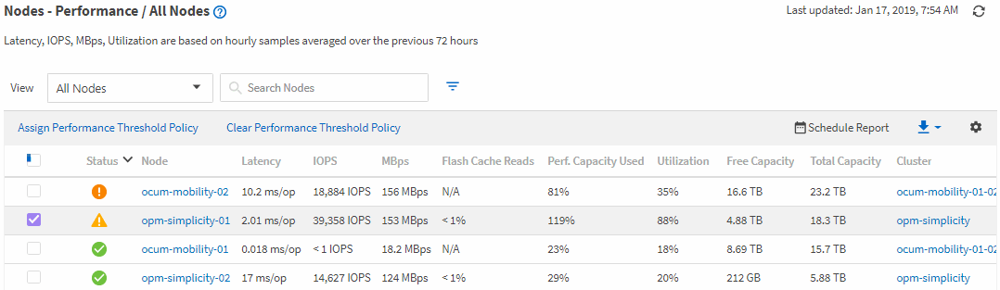

= [パフォーマンスインベントリ]ページを使用したパフォーマンスの監視
:allow-uri-read: 
:icons: font
:imagesdir: ../media/

[role="lead"]
オブジェクトインベントリパフォーマンスページには、オブジェクトタイプカテゴリ内のすべてのオブジェクトのパフォーマンス情報、パフォーマンスイベント、およびオブジェクトの健全性が表示されます。これにより、すべてのノードやすべてのボリュームなど、クラスタ内の各オブジェクトのパフォーマンスステータスの概要が一目でわかるようになります。

[Object Inventory Performance]ページには、オブジェクトステータスの概要が表示され、すべてのオブジェクトの全体的なパフォーマンスを評価してオブジェクトのパフォーマンスデータを比較できます。オブジェクトインベントリページの内容は、検索、ソート、フィルタリングによって絞り込むことができます。これは、パフォーマンスの問題があるオブジェクトをすばやく特定してトラブルシューティングプロセスを開始できるため、オブジェクトのパフォーマンスを監視および管理する場合に役立ちます。

インベントリページに表示されるオブジェクトの詳細を示すUIのスクリーンショット。]

デフォルトでは、パフォーマンスインベントリページのオブジェクトは、オブジェクトのパフォーマンスの重大度に基づいてソートされます。新しい重大なパフォーマンスイベントが発生したオブジェクトが最初に表示され、そのあとに警告イベントが発生したオブジェクトが表示されます。これにより、対処が必要な問題を簡単に特定できます。すべてのパフォーマンスデータは72時間の平均値に基づいています。

オブジェクト名の列でオブジェクト名をクリックすると、オブジェクトインベントリパフォーマンスページからオブジェクトの詳細ページに簡単に移動できます。たとえば、 Performance/AllNodes インヘントリヘエシで、 * Nodes * 列のノードオブジェクトをクリックします。オブジェクトの詳細ページには、アクティブなイベントを並べた比較など、選択したオブジェクトの詳細情報が表示されます。
