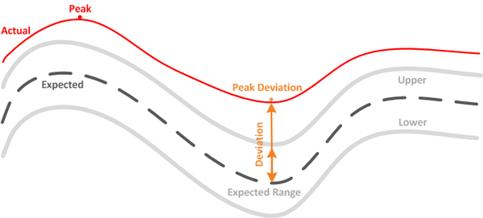

= ワークロードパフォーマンスの測定値
:allow-uri-read: 
:icons: font
:imagesdir: ../media/

[role="lead"]
Unified Manager では、過去の統計値と想定される統計値から決定されるワークロードの値のレイテンシ予測に基づいて、クラスタのワークロードのパフォーマンスを測定します。ワークロードの実際の統計値をレイテンシ予測と比較して、ワークロードのパフォーマンスが高すぎるか低すぎるかを判断します。ワークロードのパフォーマンスが想定どおりでない場合、動的なパフォーマンスイベントがトリガーされてユーザに通知されます。

次の図では、期間内の実際のパフォーマンス統計値が赤で示されています。この実測値はパフォーマンスしきい値を超えており、レイテンシ予測の上限よりも上に表示されています。ピークは期間内における実測値の最大値です。偏差は想定値（予測）と実測値の差を測定したもので、ピーク偏差は想定値と実測値の差の最大値を示します。

次の表に、ワークロードのパフォーマンスの測定値を示します。

|===
| 測定 | 製品説明 

 a| 
アクティビティ
 a| 
ポリシーグループ内のワークロードで使用されているQoS制限の割合。

[NOTE]
====
ボリュームの追加や削除、 QoS 制限の変更など、ポリシーグループに対する変更が Unified Manager で検出されると、実測値や想定値が設定された上限の 100% を超えることがあります。値が設定された制限値の100%を超えると、「>100%」と表示されます。値が設定された制限の1%未満の場合は、1%未満と表示されます。

====

 a| 
実際値
 a| 
特定の時点で測定された特定のワークロードのパフォーマンス値。

 a| 
偏差
 a| 
想定値と実測値の差です。想定範囲の上限値から想定値を引いた値を実測値から想定値を引いた値で割った比率で示されます。

[NOTE]
====
負の偏差値はワークロードのパフォーマンスが想定より低いことを示し、正の偏差値はワークロードのパフォーマンスが想定より高いことを示します。

====

 a| 
期待値
 a| 
想定される値は、特定のワークロードの過去のパフォーマンスデータの分析に基づいています。Unified Manager では、これらの統計値を分析して値の想定範囲（レイテンシ予測）を決定します。

 a| 
レイテンシ予測（想定範囲）
 a| 
レイテンシ予測は、特定の時点で想定されるパフォーマンスの上限値と下限値を予測したものです。ワークロードのレイテンシについては、パフォーマンスしきい値を上回る値が表示されます。実測値がパフォーマンスしきい値を超えると、Unified Managerは動的なパフォーマンスイベントをトリガーします。

 a| 
ピーク
 a| 
一定の期間に測定された最大値です。

 a| 
ピーク偏差
 a| 
一定の期間に測定された偏差の最大値です。

 a| 
キューの深さ
 a| 
インターコネクトコンポーネントで待機している保留中のI/O要求の数。

 a| 
利用率
 a| 
ネットワーク処理、Data Processing、およびアグリゲートコンポーネントの場合、一定期間にワークロード処理を完了するためのビジー時間の割合。たとえば、ネットワーク処理またはData ProcessingコンポーネントがI/O要求を処理する時間の割合や、アグリゲートが読み取り要求や書き込み要求に対応する時間の割合が表示されます。

 a| 
書き込みスループット
 a| 
MetroCluster構成におけるローカルクラスタのワークロードからパートナークラスタへの書き込みスループット（MB/秒）。

|===