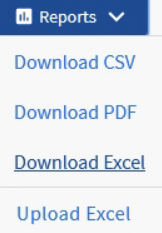
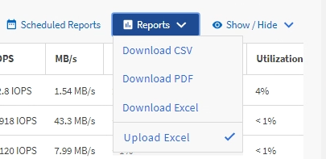

= アグリゲート容量の表とグラフを表示するレポートの作成
:allow-uri-read: 
:icons: font
:imagesdir: ../media/

[role="lead"]
合計の合計とクラスタ化された縦棒グラフ形式を使用して、Excelファイルの容量を分析するレポートを作成できます。

* 必要なもの *

* アプリケーション管理者またはストレージ管理者のロールが必要です。

次の手順に従って、健全性を開きます。すべてのアグリゲートビュー、 Excel でのビューのダウンロード、使用可能な容量グラフの作成、カスタマイズした Excel ファイルのアップロード、最終レポートのスケジュール設定を行います。

.手順
. 左側のナビゲーションペインで、 * Storage * > * Aggregates * をクリックします。
. [* レポート *>] > [* Excel のダウンロード *] を選択します。
+

+
ブラウザによっては、ファイルを保存するために * OK * をクリックする必要があります。

. 必要に応じて、 * 編集を有効にする * をクリックします。
. Excelで、ダウンロードしたファイルを開きます。
. シートの後に新しいシート() `data`を作成しimage:../media/excel_new_sheet_icon.png[""]、* Total Data Capacity *という名前を付けます。
. 新しい[Total Data Capacity]シートに次の列を追加します。
+
.. 合計データ容量（GB）
.. コミット済み容量（GB）
.. 使用済みデータ容量（GB）
.. 使用可能なデータ容量（GB）

. 各列の最初の行に、次の式を入力します。この式では、データシート（data！）を参照し、取得したデータの正しい列および行指定子を参照していることを確認します（Total Data Capacityは、列E、行2～20からデータを取得します）。
+
.. = SUM（DATA！E$2：DATA！E$20）
.. = SUM（DATA！F$2：DATA！F$50）
.. = SUM（DATA！G$2：DATA！G$50）
.. = SUM（DATA！H$2：DATA！H$50）

+
計算式では、現在のデータに基づいて各列の合計が計算されます。

image::../media/capacitysums.png[現在のデータに基づく合計容量を示すデータシートのUIスクリーンショット。]

. データシートで、列 [ 合計データ容量（ GB ） ] および [ コミット容量（ GB ） ] * を選択します。
. [ * 挿入 * （ Insert * ） ] メニューから [ * 推奨チャート * （ Recommended Charts * ） ] を選択し、 [ * クラスタ化された列 * （ * Clustered Column
. グラフを右クリックして*[グラフの移動]*を選択し、グラフをシートに移動し `Total Data Capacity`ます。
. グラフを選択したときに使用できる * デザイン * および * フォーマット * メニューを使用して、グラフの外観をカスタマイズできます。
. 問題がなければ、変更したファイルを保存します。ファイルの名前や場所は変更しないでください。
+
image::../media/cluster_column_chart_2.png[合計データ容量とコミット済み容量を示すグラフのUIスクリーンショット]

. Unified Manager で、 * Reports * > * Upload Excel * を選択します。
+
[NOTE]
====
Excelファイルをダウンロードしたビューと同じビューにいることを確認します。

====
. 変更したExcelファイルを選択します。
. * 開く * をクリックします。
. [Submit （送信） ] をクリックします。
+
[*Reports*>*Upload Excel*] メニュー項目の横にチェックマークが表示されます。

+

. [ スケジュール済みレポート ] をクリックします。
. [ レポートスケジュール ] ページに新しい行を追加して、新しいレポートのスケジュール特性を定義できるようにするには、 [ スケジュールの追加 ] をクリックします。
+
[NOTE]
====
レポートの *XLSX* 形式を選択します。

====
. レポートスケジュールの名前を入力し、他のレポートフィールドに入力して、行の最後にあるチェックマーク（）をクリックしますimage:../media/blue_check.gif[""]。
+
レポートはテストとしてすぐに送信されます。その後、指定した頻度でレポートが生成され、指定した受信者にEメールで送信されます。

レポートに表示された結果を基に、ネットワーク全体で使用可能な容量を最適に使用する方法を調査できます。
